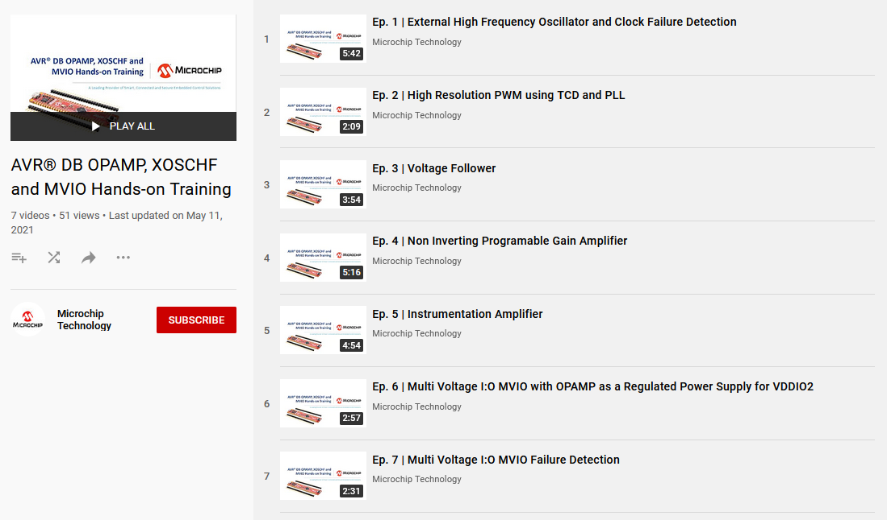
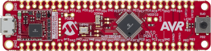
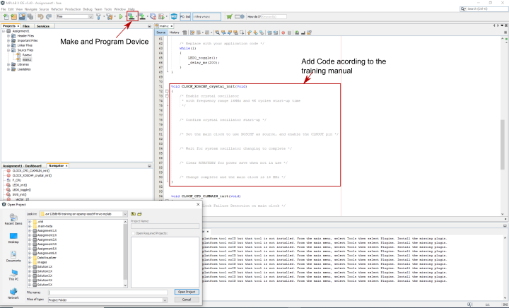

<!-- Please do not change this logo with link -->

# Training on OPAMP, XOSCHF and MVIO

This training consists of six assignments exploring some of the new features of the AVR® DB, namely the Analog Signal Conditioning (OPAMP), the High Frequency Crystal Oscillator (XOSCHF) and the Multi Voltage I/O (MVIO). 

The OPAMP peripheral features up to three internal operational amplifiers (op amps). The op amps can be configured in a multitude of different operations using internal multiplexers and resistor ladders. 

The XOSCHF enables the use of an external crystal or an external clock signal up to 32 MHz. This can be used as a clock source for the Main Clock (CLK_MAIN), the Real-Time Counter (RTC) and the 12-bit Timer/Counter Type D (TCDn).

The MVIO allows PORTC of the AVR DB to run on a different voltage domain (VDDIO2) than the rest of the PORTC.   

* **Assignment 1:**
External High-Frequency Oscillator (XOSCHF) and Clock Failure Detection (CDF)
* **Assignment 2:**
High Frequency TCD using PLL
* **Assignment 3:**
Voltage Follower
* **Assignment 4:**
Instrumentation Amplifier
* **Assignment 5:**
Op Amp as a Regulated Power Supply for VDDIO2
* **Assignment 6:**
VDDIO2 Failure Detection

Each assignment also comes with a solution project found in the corresponding solution folder. 

**Note:** The newest version of the code will be slightly different from the code seen in the Training video and guide due to header file and compiler updates.

**Click the image below to access the training video.**

 

## Related Documentation

* [Training Getting Started With AVR DB OPAMP, XOSCHF and MVIO - MPLAB®](https://microchip.com/DS40002278)
* [AVR128DB48 Device Page](https://www.microchip.com/wwwproducts/en/AVR128DB48)
* [AVR128DB48 Curiosity Nano User Guide](https://www.microchip.com/DS50003037)

### Future Reading
* [TB3286 - Getting Started With Analog Signal Conditioning (OPAMP)](https://microchip.com/DS90003286)
* [TB3272 - Getting Started With External High-Frequency Oscillator on AVR DB](https://microchip.com/DS90003272)
* [TB3287 - Getting Started With MVIO](https://microchip.com/DS90003287)

## Software Used

* [MPLAB® X IDE](https://www.microchip.com/mplab/mplab-x-ide) v6.20 or later
* [MPLAB® Code Configurator (MCC)](https://www.microchip.com/mplab/mplab-code-configurator) v5.5.1 or later
* [MPLAB® XC8](http://www.microchip.com/mplab/compilers) v2.50 or later
* MPLAB AVR-Dx_DFP version v2.6.303 or later
* [MPLAB® Data Visualizer Stand alone](https://www.microchip.com/mplab/mplab-data-visualizer) version v1.3.1677 or later
* [MPLAB® Mindi™ Analog Simulator](https://www.microchip.com/mplab/mplab-mindi)
* For the Atmel Studio version of these projects, refer to [this repository](https://github.com/microchip-pic-avr-examples/avr128db48-training-on-opamp-xoschf-mvio-studio)

## Hardware Used

* [AVR128DB48 Curiosity Nano](https://www.microchip.com/DevelopmentTools/ProductDetails/PartNO/EV35L43A)

## Setup

Most assignments can be completed using the AVR128DB48 Curiosity Nano without any extra components, but some require the MPLAB Data Visualizer stand-alone, MPLAB® Mindi™ Analog Simulator, a logic analyzer or hardware modifications. See the training manual for the setup of specific assignments.

## Operation

* Connect the AVR128DB48 Curiosity Nano to the computer using a USB cable
* Clone the repository or download the zip to get the source code
* Use MPLAB to open the `.X` projects in the folder of the desired assignment
* Complete the assignment according to the training manual 
* Press **Make and Program Device** to run the example

## Conclusion

This training facilitates a better understanding of some of the new features of the AVR DB such as the OPAMP, XOSCHF and MVIO.
